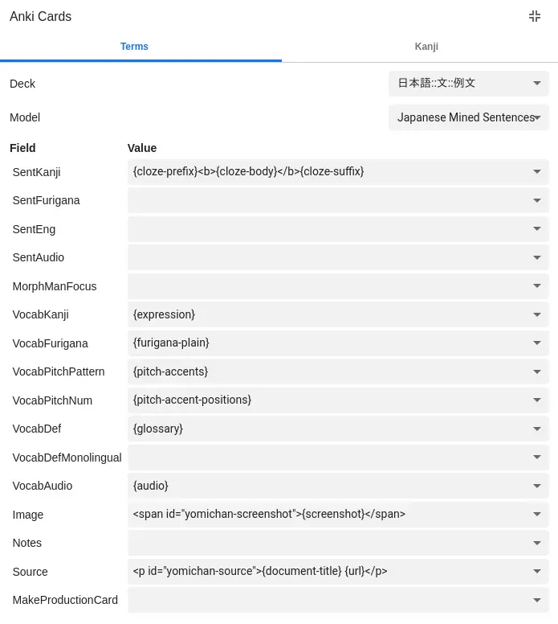

# Japanese Mined Sentences (cyphar)

This is a modified version of [Tatsumoto's Targeted Sentence Card
template][original-template], with the following modifications made to the
"Recognition" card type:

 * The target word's pitch accent colouring is not shown on the front of the
   card. Instead, a faint border is drawn around the target word (to help
   differentiate between bolded and unbolded kanji) on the front of the card.
   The border disappears once you flip the card.

   This allows you to first try to recall the pitch accent of a word before you
   review the card (so that you can decide whether you want ot pass or fail the
   card based on whether you got the pitch accent correct -- or you can just
   try to remember it to help exercise that part of your memory without failing
   the card if you got it wrong).

 * A new field is added `VocabDefMonolingual`, which is useful for folks
   starting the monolingual transition. If you add a definition in this field,
   the `VocabDef` field is displayed using `{{hint:...}}` on the back of the
   card (meaning you have to click it in order to see it). Thus if you place
   your monolingual definition in this field, and the bilingual definition in
   `VocabDef`, you can first try to read the monolingual definition.

   I find that if both definitions are visible, my eyes immediately go to the
   bilingual definition even if it wasn't necessary for me to do so.

I personally use these cards for sentence mining with Yomichan and Mpvacious.

|           Front           |
| :-----------------------: |
|  |

|        Back (Bilingual Hidden)       |          Back (Multilingual)         |
| :----------------------------------: | :----------------------------------: |
|   |  |

[original-template]: ../Japanese%20sentences/

## Included card types

### 1: Recognition

Used to test reading comprehension of a whole Japanese sentence, with the i+1
(target) word outlined with a border. Pitch accent information, reading, word
audio, definition, and other source information (sentence audio, screenshot,
notes) are shown on the back.

This is very similar to the recognition card type from [the original
template][original-template]. However, I use Yomichan's pitch accent
information for the target word (using the Kanjium Pitch Accent dictionary, and
double-checking it with the monolingual dictionary).

While you can use [JaPitch][anki-japitch] with this note type I haven't really
tried using it. I might revisit this in the future, because it does seem more
useful than Yomichan's pitch information (which doesn't mention nasal and
devoiced mora). But I like that with Yomichan I can see what reading is going
to be added, while with tools like JaPitch it feels a bit too magical.

[anki-japitch]: https://ankiweb.net/shared/info/1225470483

### 2: Production

This is a carbon copy of the production card type from [the original
template][original-template].

## Yomichan settings

The Yomichan settings for this card type are very similar to [the original
template][original-template], though I use the Yomichan-provided word audio for
the `VocabAudio` field. Leave the new `VocabDefMonolingual` field blank, so you
can add to it manually in the browser.



By using `{cloze-prefix}<b>{cloze-body}</b>{cloze-suffix}` for `SentKanji`, the
targeted word will be automatically highligted. If you prefer to do the
highlighting yourself (or don't want to highlight the target word on the card
front), use `{sentence}` instead. Note that Yomichan can be a bit peculiar when
deciding how much of a conjugated verb counts as "part" of the verb, so double
check that you're happy with the automatic highlighting.

## Japanese Support settings

If you use the [Japanese Support add-on][anki-jpn], make sure to modify
its configuration (`Tools > Add-ons > [Select "Japanese Support"] > Config`) as
follows:

 * Add `"SentFurigana"` to the end of the `dstFields` array.
 * Add `"SentKanji"` to the end of the `srcFields` array.

This is necessary for the Japanese Support add-on to auto-generate readings
when you tab from the `SentKanji` field to `SentFurigana`. *Make sure you check
the readings, because the Japanese Support add-on doesn't always get them
right!*

Your final config should look something like this:

```json
{
    "dstFields": [
        "Reading",
        "Reading",
        "SentFurigana"
    ],
    "furiganaSuffix": " (furigana)",
    "noteTypes": [
        "japanese"
    ],
    "srcFields": [
        "Expression",
        "Kanji",
        "SentKanji"
    ]
}
```

If you change the name of this note type such that it no longer contains the
word "Japanese" in its name, please add the note type name to `"noteTypes"`.

[anki-jpn]: https://ankiweb.net/shared/info/3918629684

## JaPitch settings

As with the Japanese Support add-on, you need to add the right field to
`srcFields`. However, because the JaPitch add-on writes to `VocabPitchPattern`
you don't need to modify `dstFields`. And instead of adding `SentFurigana`, you
want to add `VocabKanji`. I also would set `regenerateReadings` to true because
JaPitch provides more information than Yomichan.

Note that this can lead to extra readings being generated, and you cannot
currently force it to only use the correct reading by setting the source field
to `VocabFurigana` (doing so will lead to an entirely wrong reading to be
generated because it treats the furigana as a separate word, breaking up the
expression into multple parts).

Your final config should look something like this:

```json
{
    "dstFields": [
        "VocabPitchPattern"
    ],
    "generateOnNoteFlush": true,
    "lookupShortcut": "Ctrl+8",
    "noteTypes": [
        "japanese"
    ],
    "pronunciationHiragana": false,
    "regenerateReadings": true,
    "srcFields": [
        "Expression",
        "Kanji",
        "VocabKanji"
    ],
    "styles": {
        "&#42780;": "&#42780;",
        "class=\"nasal\"": "style=\"color: red;\"",
        "class=\"nopron\"": "style=\"color: royalblue;\"",
        "class=\"overline\"": "style=\"text-decoration:overline;\""
    },
    "useMecab": true
}
```

If you change the name of this note type such that it no longer contains the
word "Japanese" in its name, please add the note type name to `"noteTypes"`.
