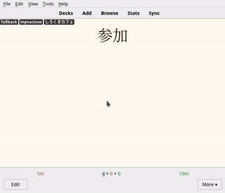
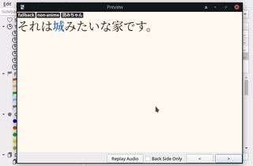
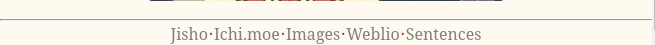
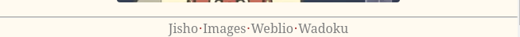
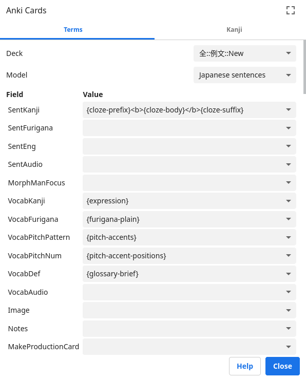

# Japanese fallback

This card template was brought to you by `ﾌｪﾘﾍﾟ`. It is based on [Japanese sentences](https://github.com/Ajatt-Tools/AnkiNoteTypes/tree/main/templates/Japanese%20sentences#japanese-sentences) and on [card template provided by a DJT user](https://tatsumoto-ren.github.io/blog/discussing-various-card-templates.html#fallback-cards).



Fallback cards (FBCs) are similar to SWCs and TSCs at first: you’ve got the target word on the front of the card and whatever you need to understand it on the back, an example sentence and pitch accent information -- if you make cards using [Mpvacious](https://github.com/Ajatt-Tools/mpvacious), you’ve also got the audio of the example sentence and an image. (That looks like SWCs, right?) When you hover over the target word a sentence appears, giving you the context in which you found the target word.
FBCs allow you do the following:
* Have a backup when you go like, “what the hell am I looking at?!” (hence its [name](https://www.oxfordlearnersdictionaries.com/definition/english/fallback?q=fallback))
* Forget about context-dependent memories but still benefit from TSCs, since you’re testing yourself on the target word and still have the benefits that [TSCs can provide](https://tatsumoto-ren.github.io/blog/discussing-various-card-templates.html#targeted-sentence-cards-or-mpvacious-cards) on the back;
* Be flexible. A word becomes easier as you get familiar with it -- by seeing it on your immersion or on Anki. At first you can use the hover feature to review the card as a TSC, and later as a SWC when you’re already familiar with the word and don’t need a backup plan anymore.

## Converting TSCs into FBCs　(and vice versa)

It’s easy to convert your Mpvacious, TSC, cards into FBCs. Select all the cards you want to convert, > Change note type > select “Fallback card” and make sure that each field is matching with each other.



## Footer



I’ve changed the original footers of Japanese sentences to match my needs. “Ichi.moe” is better than Jisho to parse sentences, in my opinion. “Images” puts the target word on Google JP, rather than the whole sentence. “Sentences” searchs the target word on Sentence Search, giving you more example sentences (tip: you can you can mine cards from that site).
Here’s the original footer of Japanese sentences:
```
<footer>{{#SentKanji}}<a
    href="https://jisho.org/search?keyword={{kanji:text:SentKanji}}" title="Sentence on Jisho">Jisho</a><a
    href="https://www.google.co.jp/search?q={{kanji:text:SentKanji}}&tbm=isch" title="Search images">Images</a
    >{{/SentKanji}}{{#VocabKanji}}<a
    href="http://www.weblio.jp/content/{{text:VocabKanji}}" title="Vocab on Weblio">Weblio</a><a
    href="https://wadoku.de/search/?q={{text:VocabKanji}}" title="Vocab on Wadoku">Wadoku</a>{{/VocabKanji}}</footer
>
```



## Included card types

### 1: Recognition

This card type tests your reading comprehension.
On the front side, there is a target word, when you hover over it, an example sentence appears.
On the back there's the sentence you found your target word. On the back you can put the definitions and pronunciations of the target word, as well as pictures and sentence audio -- I use Mpvacious and Yomichan to create cards from anime, so all that work is done for me.
The note type also contains a separate field for Japanese pitch accent pattern.
I use [this Anki add-on](https://ankiweb.net/shared/info/1225470483) to generate pitch accents.

### 2: Production

This card type is designed to teach you how to write the target word.
To make a production card select the desired note in the Anki Browser
and fill the MakeProductionCard field with any text you like.
The target word on the new card is replaced with its kana reading,
and your goal is to write it in kanji.
The back of the card includes a stroke order diagram for the target word.

For further explanation, see [Writing Japanese guide](https://tatsumoto-ren.github.io/blog/writing-japanese.html).

## Yomichan settings



Adding `{cloze-prefix}<b>{cloze-body}</b>{cloze-suffix}` to the settings
lets you automatically highlight the target word.

## Japanese Support settings

To configure the [Japanese support](https://ankiweb.net/shared/info/3918629684) add-on,
open Anki and go to Tools > Add-ons > Japanese Support > Config.
My config looks like this:

```
{
    "dstFields": [
        "SentFurigana",
        "VocabFurigana"
    ],
    "furiganaSuffix": " (furigana)",
    "noteTypes": [
        "japanese",
        "subs2srs"
    ],
    "skipNumbers": false,
    "srcFields": [
        "SentKanji",
        "VocabKanji"
    ]
}
```

Make sure to apply these settings to be able to generate furigana when using this Note Type.

It’s good to try new things out, so give it a try. You might like it.
