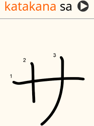

# Japanese kana production

A note type for practicing producing kana from memory.
Used in the kana production deck.

See [this article](https://tatsumoto.neocities.org/blog/writing-japanese.html#writing-kana) for details.

