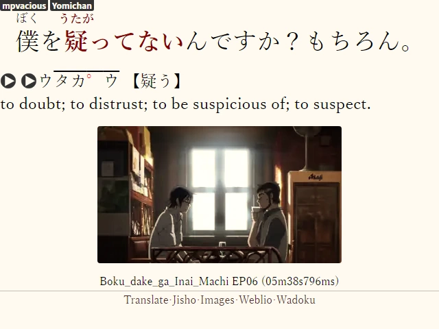
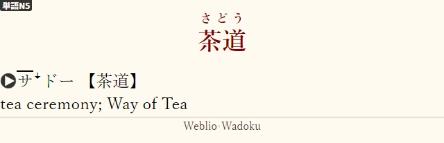

# Japanese sentences (nb)

This is Tatsumoto's [Japanese sentences][] template which I've altered to my
liking.  I'm not sure why would anyone prefer this one, but in such unlikely
case it is here for your convenience.

## What's different?

In this document I will only mention the modifications to the original
template; for general information about it refer to the link above.

### Single template for both targeted sentence cards and word cards

The template was altered to show `VocabKanji`/`VocabFurigana` pair in place of
`SentKanji`/`SentFurigana` when the former are empty.  This makes it suitable
not only for sentence cards, but for word cards too.  In fact, I have converted
my entire collection (which contains both mined notes and the entirety of
[Ankidrone Starter Pack][]) to this note type and enjoy the following benefits
of having single card type for all purposes:

  * Whenever I want to convert a word card to a TSC card or the other way
    around, I don't have to do a full database upload on the next sync.
  * If I want to change the appearance of my cards, there is only one place to
    make edits to, instead of two or more.

### Added fields, removed fields

  * `Source` field was added for sake of recording the origin of a mined
    sentence.  It is displayed in less prominent fashion than the `Notes` field
    and doesn't distract you from the actual notes that you might have.  This
    feature was shamelessly borrowed from cyphar's [Japanese Mined Sentences][]
    template.
  * `MorphManFocus` field was removed together with its related JavaScript and
    styling, since I don't use MorphMan.
  * `VocabPitchNum` field was removed together with pitch accent colorizing
    script.  I found the colorization annoying, and apart from machine
    processing, pitch numbers are superseded by proper pitch accent annotations
    presented in the `VocabPitchPattern` field.

## Screenshots

Below are the screenshots of *Recognition* cards.  *Production* cards are not
much different.

 
*A sentence card.  Notice the `Source` field below the image.*

 
*A word card.*

## Configuration

Most of the instructions for *Japanese sentences* template apply here as well,
with few changes.

### *Yomichan* settings

I prefer letting [AJT Pitch Accent][] add-on generate pitch accents instead of
*Yomichan*, as HTML produced by the former is much cleaner than that of the
latter.  Therefore, *Yomichan*'s card format configuration becomes even
simpler:

| Field           | Value                                             |
| --------------- | ------------------------------------------------- |
| `SentKanji`     | `{cloze-prefix}<b>{cloze-body}</b>{cloze-suffix}` |
| `VocabKanji`    | `{expression}`                                    |
| `VocabFurigana` | `{furigana-plain}`                                |
| `VocabDef`      | `{glossary-brief}`                                |

### *mpvacious* settings

Make sure that your `subs2srs.conf` contains these lines:

    miscinfo_enable=yes
    miscinfo_field=Source

## Tips and tricks

  * If you want to try this template out, you don't need to say goodbye to
    contents of `MorphManFocus` and `VocabPitchNum` fields in your cards.
    Import the template, then manually add these two fields back.  After that,
    you can convert your notes with no data loss.  `antp.sh update` will work
    safely as well.
  * *Ankidrone Starter Pack* decks *N2* and *N1* contain item numbers in the
    `Notes` field.  When converting them, you may want to map `Notes` to
    `Source`.

  [AJT Pitch Accent]: https://ankiweb.net/shared/info/1225470483
  [Ankidrone Starter Pack]: https://tatsumoto.neocities.org/blog/basic-vocabulary.html#anki-deck
  [Japanese Mined Sentences]: ../Japanese%20Mined%20Sentences%20(cyphar)
  [Japanese sentences]: ../Japanese%20sentences
