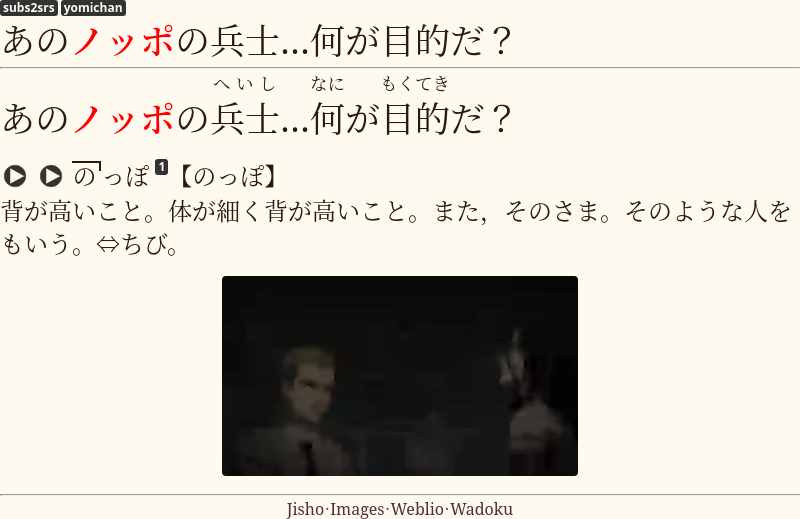
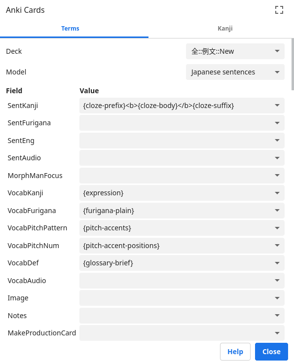

# Japanese sentences

[Targeted sentence cards](https://tatsumoto-ren.github.io/blog/discussing-various-card-templates.html#targeted-sentence-cards-or-mpvacious-cards)
for learning Japanese.
Can be used for everyday sentence mining, as well as for storing premade sentence packs.

## Included card types

### 1: Recognition

This card type tests your reading comprehension.
On the front side, there is an example sentence.
The sentence has one target word or phrase.
I usually highlight the target word in bold.
On the back you can put the definitions and pronunciations of the target word, as well as pictures.
The note type also contains a separate field for Japanese pitch accent pattern.
I use [this Anki add-on](https://ankiweb.net/shared/info/1225470483) to generate pitch accents.

### 2: Production

This card type is designed to teach you how to write the target word.
To make a production card select the desired note in the Anki Browser
and fill the MakeProductionCard field with any text you like.
The target word on the new card is replaced with its kana reading,
and your goal is to write it in kanji.
The back of the card includes a stroke order diagram for the target word.

For further explanation, see [Writing Japanese guide](https://tatsumoto-ren.github.io/blog/writing-japanese.html).

## Yomichan settings

Adding `{cloze-prefix}<b>{cloze-body}</b>{cloze-suffix}` to the settings
lets you automatically highlight the target word.
