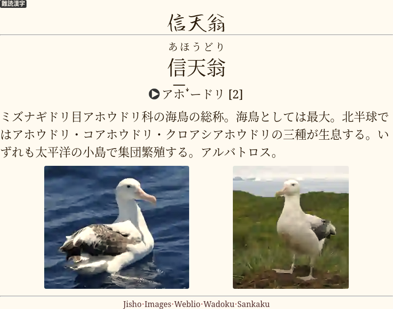
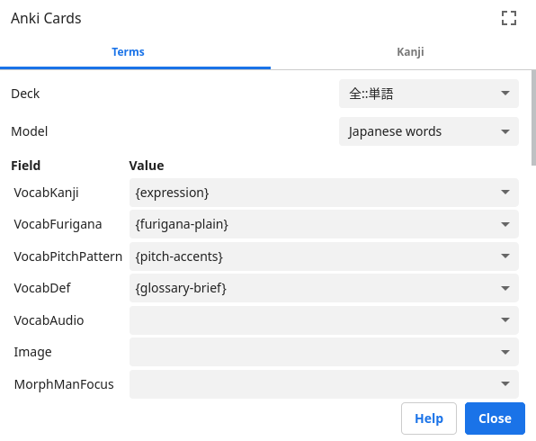

# Japanese words

[Simple Word Cards](https://tatsumoto-ren.github.io/blog/discussing-various-card-templates.html#simple-word-cards)
for studying Japanese.
They test reading comprehension of a single word.
On the back you can put pictures, definitions and pronunciations of the target word.

## Yomichan settings

